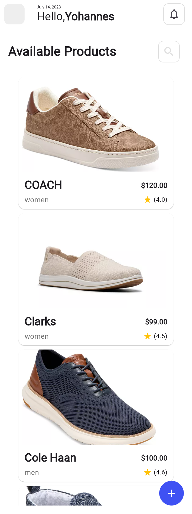
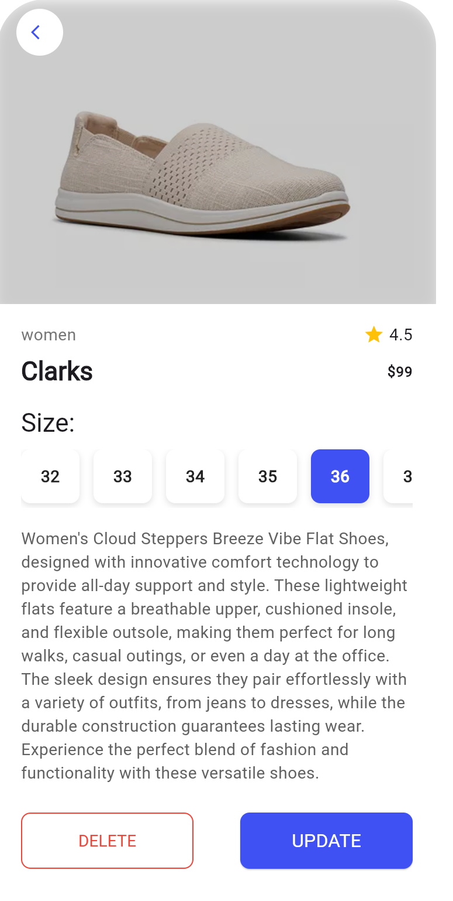
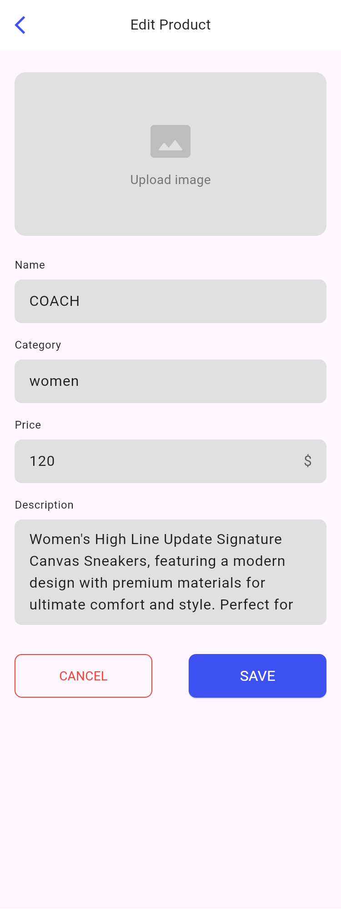

# Product Catalog App

A simple Flutter e-commerce app demonstrating:

- Home page with a grid of products
- Detail page for viewing product info & selecting size
- Search page with filters
- Add & Edit product pages with forms

---

## Navigation Routes

The app uses named routes for seamless navigation between screens:

- `/` – **Home Page**: Displays a grid of products.
- `/detail` – **Detail Page**: Shows detailed information about a single product.
- `/search` – **Search Page**: Provides search functionality with filters.
- `/add` – **Add Product Page**: Form to add a new product.
- `/edit` – **Edit Product Page**: Form to edit an existing product.

_Note: see `lib/main.dart` for the exact route definitions and usage of `Navigator.pushNamed`._

---

## Architecture

This project follows **Clean Architecture** to separate concerns:

```
lib/
├── core/                     ← Shared utilities and base classes
│   ├── error/                ← Failure definitions
│   └── usecase/              ← Base `UseCase` and `NoParams`
├── features/                 ← Feature modules
│   └── product/              ← “Product” feature
│       ├── data/             ← Data layer
│       │   ├── models/       ← JSON ↔ Dart `ProductModel`
│       │   ├── datasources/  ← Remote/local data sources
│       │   └── repositories/ ← `ProductRepositoryImpl`
│       ├── domain/           ← Domain layer
│       │   ├── entities/     ← `Product` entity
│       │   ├── repositories/ ← `ProductRepository` (contract)
│       │   └── usecases/     ← Business logic (`ViewAllProductsUsecase`, etc.)
│       └── presentation/     ← UI layer
│           ├── blocs/        ← Bloc for state management
│           └── pages/        ← Widgets and screens
└── main.dart                 ← App entry point and DI setup
```

- **Core**: Holds shared abstractions—error handling and the generic UseCase base class.
- **Data**: Implements the repository contract, maps JSON to models, and caches locally.
- **Domain**: Pure Dart—entities, abstract repos, and use-case logic.
- **Presentation**: UI code, BLoC communicate with domain use cases.

---

## Data Flow

1. **User Interaction**

   - User taps a button or opens a page in the UI (e.g. “Load all products” on Home).

2. **Presentation Layer**

   - A Bloc receives the event and calls the corresponding **UseCase**.

3. **Domain Layer**

   - **UseCase** executes, delegating to a **ProductRepository** (abstract).
   - Returns a `Future<Either<Failure, T>>`—either a `Failure` or the expected data (`Product`, `List<Product>`, or `void` for commands).

4. **Data Layer**

   - The concrete `ProductRepositoryImpl` uses remote and/or local **DataSources**.
   - **Models** (`ProductModel.fromJson`/`toJson`) map API responses into domain entities.
   - Errors are caught and wrapped as `Failure` objects instead of exceptions.

5. **Back to Presentation**

   - Bloc maps the `Either` result into UI states (loading, success, error).
   - Widgets rebuild to show data or error messages.

---

## Directory Structure

```text
lib/
├─ core/
│  ├─ error/
│  └─ usecase/
├─ features/
│  └─ product/
│     ├─ data/
│     │  ├─ models/
│     │  ├─ datasources/
│     │  └─ repositories/
│     ├─ domain/
│     │  ├─ entities/
│     │  ├─ repositories/
│     │  └─ usecases/
│     └─ presentation/
│        ├─ blocs/
│        └─ pages/
└─ main.dart
```

---

## Screenshots

### Home Page



### Detail Page



### Search Page


### Add Product Page


### Edit Product Page



---

## Getting Started

```bash
flutter pub get
flutter run
```

---

## Testing

- **Unit Tests** (models, use cases):

  ```bash
  flutter test
  ```

- **Lint & Analyze**:

  ```bash
  flutter analyze
  ```
