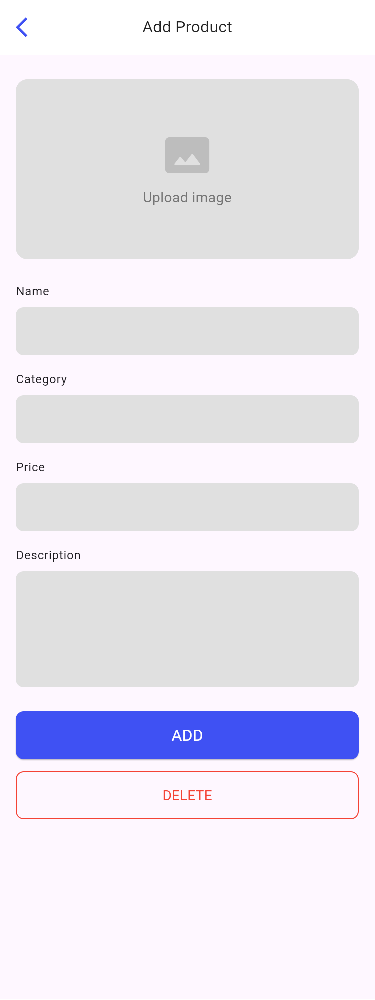

# Product Catalog App

A simple Flutter app demonstrating:

- Home page with a grid of products
- Detail page for viewing product info & selecting size
- Search page with filters
- Add & Edit product pages with forms

---

## Navigation Routes

The app uses named routes for seamless navigation between pages. Each route corresponds to a specific screen in the app. Below is a summary of the routes:

- `/` - Home Page: Displays a grid of products.
- `/add` - Add Product Page: Allows users to add a new product.
- `/edit` - Edit Product Page: Enables editing of an existing product.
- `/search` - Search Page: Provides search functionality with filters.
- `/detail` - Detail Page: Shows detailed information about a product.

Refer to the code snippet below for route definitions and examples of how to navigate between them.

---

## Screenshots

> **Place your images in** `assets/screenshots/` **and name them exactly as below**.

### Home Page

### Detail Page

### Search Page

### Add Product Page

### Edit Product Page

